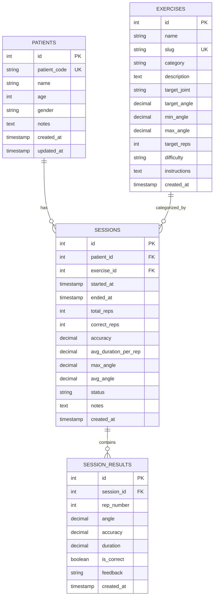

# 🗄️ PhysioVision - Database Architecture & Schema

## Entity Relationship (ER) Diagram



---

## Table Definitions

### 1. `patients`
Stores registered rehabilitation patients.
```sql
CREATE TABLE patients (
    id INT AUTO_INCREMENT PRIMARY KEY,
    patient_code VARCHAR(50) NOT NULL UNIQUE,
    name VARCHAR(150) NOT NULL,
    age INT NOT NULL,
    gender ENUM('male', 'female', 'other') DEFAULT 'male',
    notes TEXT NULL,
    created_at TIMESTAMP DEFAULT CURRENT_TIMESTAMP,
    updated_at TIMESTAMP DEFAULT CURRENT_TIMESTAMP ON UPDATE CURRENT_TIMESTAMP
);
```

### 2. `exercises`
Defines rehabilitation exercise rules, target angles, and repetition limits.
```sql
CREATE TABLE exercises (
    id INT AUTO_INCREMENT PRIMARY KEY,
    name VARCHAR(150) NOT NULL,
    slug VARCHAR(100) NOT NULL UNIQUE,
    category VARCHAR(100) DEFAULT 'Upper Body',
    description TEXT NOT NULL,
    target_joint VARCHAR(100) NOT NULL,
    target_angle DECIMAL(5,2) NOT NULL,
    min_angle DECIMAL(5,2) NOT NULL,
    max_angle DECIMAL(5,2) NOT NULL,
    target_reps INT NOT NULL DEFAULT 10,
    difficulty ENUM('beginner', 'intermediate', 'advanced') DEFAULT 'beginner',
    instructions TEXT,
    created_at TIMESTAMP DEFAULT CURRENT_TIMESTAMP
);
```

### 3. `sessions`
High-level summary of a patient's exercise routine execution.
```sql
CREATE TABLE sessions (
    id INT AUTO_INCREMENT PRIMARY KEY,
    patient_id INT NOT NULL,
    exercise_id INT NOT NULL,
    started_at TIMESTAMP DEFAULT CURRENT_TIMESTAMP,
    ended_at TIMESTAMP NULL,
    total_reps INT NOT NULL DEFAULT 0,
    correct_reps INT NOT NULL DEFAULT 0,
    accuracy DECIMAL(5,2) NOT NULL DEFAULT 0.00,
    avg_duration_per_rep DECIMAL(6,2) DEFAULT 0.00,
    max_angle DECIMAL(5,2) DEFAULT 0.00,
    avg_angle DECIMAL(5,2) DEFAULT 0.00,
    status ENUM('in_progress', 'completed', 'cancelled') DEFAULT 'completed',
    notes TEXT NULL,
    created_at TIMESTAMP DEFAULT CURRENT_TIMESTAMP,
    FOREIGN KEY (patient_id) REFERENCES patients(id) ON DELETE CASCADE,
    FOREIGN KEY (exercise_id) REFERENCES exercises(id) ON DELETE CASCADE
);
```

### 4. `session_results`
Fine-grained log for each individual repetition within a session.
```sql
CREATE TABLE session_results (
    id INT AUTO_INCREMENT PRIMARY KEY,
    session_id INT NOT NULL,
    rep_number INT NOT NULL,
    angle DECIMAL(5,2) NOT NULL,
    accuracy DECIMAL(5,2) NOT NULL,
    duration DECIMAL(6,2) NOT NULL DEFAULT 0.00,
    is_correct TINYINT(1) NOT NULL DEFAULT 1,
    feedback VARCHAR(255) DEFAULT 'Good form',
    created_at TIMESTAMP DEFAULT CURRENT_TIMESTAMP,
    FOREIGN KEY (session_id) REFERENCES sessions(id) ON DELETE CASCADE
);
```
